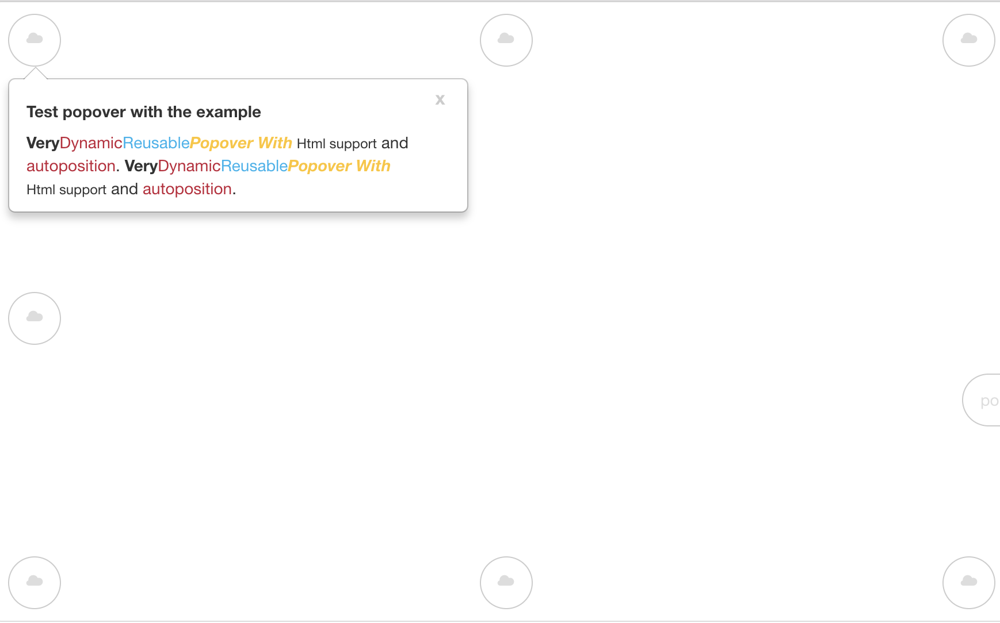

# ngm-popover  


This library support to angular 4, 5, 6 and 7.  There are  options to 
# Demo
<https://demo-ngm-popover.stackblitz.io>

<https://stackblitz.com/edit/demo-ngm-popover>
## Installation  
  
To install this library, run:  
  
```bash  
$ npm install ngm-popover --save  
```  
  
  ##  Options
  | Function name | Description                  |
| ------------- | ------------------------------ |
| `maxWidth`    | The default value is `400px`. this value it's going to set in the style `max-width`  |
| `minWidth`    | The default value is `200px`.  this value it's going to set in the style `min-width`|
| `placement`    | The default value is `auto` but you can to change the value with these options `bottom-right` , `bottom-left`, `top-left`, `top-right`, `right`, `left`, `top` and `bottom`|
## Consuming your library  
  
Once you have published your library to npm, you can import your library in any Angular application by running:  
  
```bash  
$ npm install ngm-popover --save  
```  
  
and then from your Angular `AppModule`:  
  
```typescript  
import { BrowserModule } from '@angular/platform-browser';  
import { NgModule } from '@angular/core';  
  
import { AppComponent } from './app.component';  
  
// Import your library  
import  { NgmPopoverModule }  from  'ngm-popover';  
  
@NgModule({  
  declarations: [  
    AppComponent  
  ],  
  imports: [  
    BrowserModule,  
  
    // Specify your library as an import  
    NgmPopoverModule.forRoot()
  ],  
  providers: [],  
  bootstrap: [AppComponent]  
})  
export class AppModule { }  
```  
  
Once your library is imported, you can use its components, directives and pipes in your Angular application:  
  
```xml  
<!-- You can now use your library component in app.component.html -->  
<div id="specify" class="content active">
	<a class="btn btn-default" [popover]="popoverId">
		 <i class="glyphicon glyphicon-cloud"></i>
	</a>  
</div>  

<ngm-popover #popoverId placement="auto">   
 <b>Very</b> <span style="color: #C21F39">Dynamic</span>
 <span style="color: #00b3ee">Reusable</span>  
 <b><i><span style="color: #ffc520">Popover With</span></i></b>  
 <small> Html support</small>  
  and <span style="color: #C21F39"> autoposition</span>.  
  <b>Very</b> <span style="color: #C21F39">Dynamic</span> <span style="color: #00b3ee">Reusable</span>  
 <b><i><span style="color: #ffc520">Popover With</span></i></b>  
 <small> Html support</small>  
  and <span style="color: #C21F39"> autoposition</span>.  
</ngm-popover>
```  
  

  
## License  
  
MIT © [Milver Flores Acevedo](mailto:mfflowg@gmail.com)
